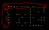
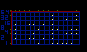

# Forensics 300 Solution

## Solution

The script to solve forensics 300 does the following:

1. Extract the file `scans.tar.gz` to a new directory `scans/`.
2. Write a script to perform steps 3-6 for each file matching `scans/*.png`.
3. Locate the pixel (let's call it the "origin") closest to the upper left corner of the image that's hex color code is in the range `FFFF77` to `FFFF88` (inclusive). The colors in this range are only used for drawing dot matrices. The range can be determined by manually checking a few of the dots in the matrices to test for the limits. This pixel is the upper left of the machine identification code.
4. The leftmost column is a parity column, and the uppermost row is a parity row (see below image; the parity columns are circled in red, and origin pixel is circled twice). So, repeat steps 5-6 14 times (as dot matrices are 15 pixels wide after spacing is taken out, minus the 1 parity column to the very left).

5. Find the column to the immediate right of the parity column, and begin summing up the values in the column, where each bit is represents a binary 1 or 0, counting from the bottom up (as seen in the below image. Green represents the parity pixels and should not be counted when summing the values). Each column is a number that can be found by reading its bits.

6. Now convert each number in each column (all of which are less than 255) to an their ASCII representation (e.g. `41` -> `A`). Concatenate all of the characters together. If the resulting string contains "BSidesPDX", write the string to stdout. Otherwise, the image is not the one containing the flag.

------

That's fairly complicated. This machine identification code is based off of one found by the EFF. Here is the EFF's explanation: https://en.wikipedia.org/wiki/Machine_Identification_Code#/media/File:Machine_Identification_Code_von_Druckern.png

The flag is stored in one the machine identification codes on the scans of paper. The goal is to find which one.

## Fun Fact

Originally, the problem used realistic 600 dpi scans of paper with to-scale machine identification codes. Unfortunately, each scan, after being compressed, was about 13 megabytes. This is not practical for 100 scans of paper, so I had to turn the resolution down quite a bit.
